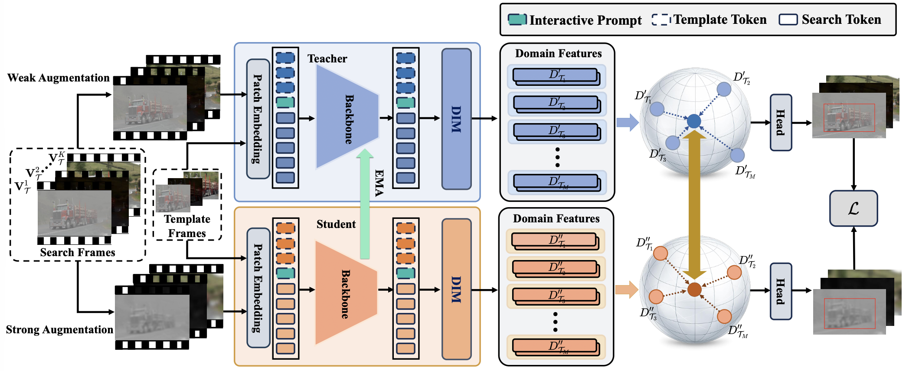
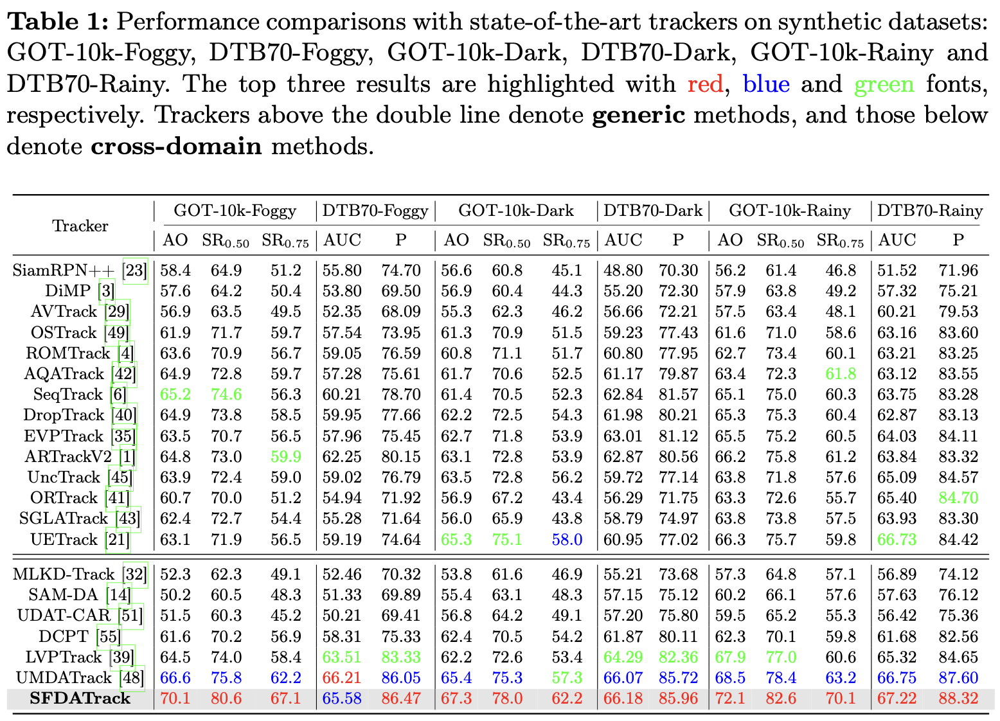

# SFDATrack
The implementation for the ECCV 2026 paper [_SFDATrack: Generalized Source-Free Domain Adaptive Tracking Under Adverse Weather Conditions_](http://arxiv.org/abs/2607.00369)

## Introduction

<p align="left">
  
</p>

Overview of the proposed SFDATrack. The input target video is first augmented into weak and strong views, which are processed by the teacher and student encoders, respectively. The extracted features are further fed into the Dual Interactive Mamba (DIM) module and Hyperspherical Prototype Projection (HPP) module to enhance domain consistency and representation robustness. Finally, a total loss $\mathcal{L}$ is applied to jointly optimize the tracking framework, ensuring stable and consistent feature learning across domains.

## Performance

<p align="left">
  
</p>

## Install the environment

Create and activate a conda environment:
```
conda create -n sfdatrack python=3.10 -y
conda activate sfdatrack 
```
Then install the required packages:
```
bash install.sh
```
Install causal-conv1d from source:
```
git clone https://github.com/Dao-AILab/causal-conv1d.git
cd causal-conv1d
pip install -e .
cd ..
```
Install mamba：
```
pip install -e mamba
```

## Set project paths

Run the following command to set paths for this project
```
python tracking/create_default_local_file.py --workspace_dir . --data_dir ./data --save_dir ./output
```
After running this command, you can also modify paths by editing these two files
```
lib/train/admin/local.py  # paths about training
lib/test/evaluation/local.py  # paths about testing
```

## Dataset Preparation

Put the tracking datasets in ./data. It should look like this:
```
${PROJECT_ROOT}
 -- data
     -- got10k_dark
         |-- test
         |-- train
         |-- val   
     -- got10k_haze
         |-- test
         |-- train
         |-- val 
     -- got10k_rainy
         |-- test
         |-- train
         |-- val         
``` 
Our datasets are derived from [UMDATrack](https://github.com/Z-Z188/UMDATrack). And the datasets are now available in [BaiduNetdisk](https://pan.baidu.com/s/1sEn0E3-Kt1X5KZYYovIYYA?pwd=es5c) and [huggingface](https://huggingface.co/datasets/WatcherBrR0/synthetic_datasets)

## Training

Download our [pretrained source model](https://pan.baidu.com/s/1jyodsO0WGR_r_xV9D20mZQ?pwd=jxdv) and initial [pseudo-labels](https://pan.baidu.com/s/1Xsn45GZEI35vkv6jEQ0ZHA?pwd=wi9a). Then put it under  `$PROJECT_ROOT$/pretrained_models` and place the initial pseudo-labels in the output folder (e.g., `./output/pseudo_label`)   
Run the command below to train the model:

```
python tracking/train.py --script sfdatrack --config baseline_vit --save_dir ./output --mode multiple --nproc_per_node 2  --use_wandb 0
```
Replace `--config` with the desired model config under `experiments/sfdatrack`. We use [wandb](https://github.com/wandb/client) to record detailed training logs, in case you don't want to use wandb, set `--use_wandb 0`.

## Evaluation
Change the corresponding values of `lib/test/evaluation/local.py` to the actual benchmark saving paths

Testing examples in different domains:
- DTB70 for darkness or other off-line evaluated benchmarks (modify `--dataset` correspondingly)
```
python tracking/test.py sfdatrack baseline_vit --dataset dtb70_dark --runid 0001 --ep 50 --save_dir output
python tracking/analysis_results.py # need to modify tracker configs and names
```
- GOT10K-dark
```
python tracking/test.py sfdatrack baseline_vit --dataset got10k_test_dark --runid 0001 --ep 50 --save_dir output
python lib/test/utils/transform_got10k.py # need to modify tracker configs and names
```
Or you can also use NAT2021 and UAVDark70 for evaluation.

## Acknowledgement
Thanks to [OSTrack](https://github.com/botaoye/OSTrack) and PyTracking for their excellent work.
